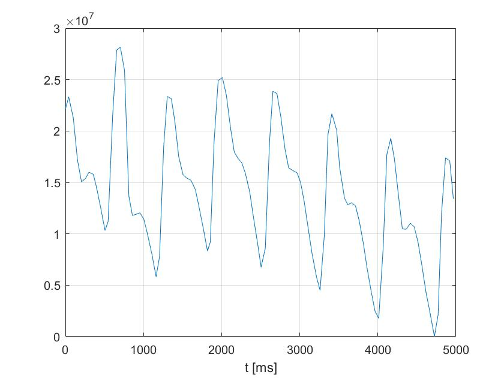

# Smartphone photoplethysmography (SPPG)
## What is [PPG](https://en.wikipedia.org/wiki/Photoplethysmogram)?
#### Plethysmography is the science of measuring volume changes in different parts of the body.

- A photoplethysmograph uses light to detect blood volume changes in the microvascular bed of tissue. 
- This noninvasive technology can be utilized to measure heart rate, and a number of other physiological parameters. 
- Traditionally the measurement is carried out with a pulse oximeter
- A pulse oximeter is a small wearable device (clipped to a for example a finger) which collects and analyzes the reflected or transmitted waves after casting light on the bodypart.

## Heart rate (HR) monitoring with a smartphone?

Smartphones have just the tools a professional PPG has: a ligt source (the flash) and a photosensor (the camera). 
They have the potential to determine HR in real time, after covering the camera and the flash with a fingertip at the same time. 
This way the light reflected from the finger is collected by the camera. HR is calculated after the necessary signal processing.

## Usage
1. Place a single finger on the back of your phone and cover both the camera and the flash
2. Press the HR button, and do not release until you wish to finish the measurement
3. A new calculated HR will appear on the screen every 3 seconds

> Note: try to stay still for the best results while holding the button (the device will notify you otherwise)

## How does it work?
The light reflected from the fingertip is collected. The total intensity of the red component is calculated for each frame. 
(Infrared can penetrate the tissues, but red is the closest thing we have using the flashlight). The values go through a number of
signal processing steps. The heart rate is calculated from the distances of the peaks, and the UI is updated with the fresh HR value.

The signal looks something like this, before applying filters for smoothing:  

## Credits
The project is built on the frame processing capabilities of [CameraView](https://github.com/natario1/CameraView) (a wrapper library for the android Camera 1 and 2 API).
Low Pass Filtering is achieved with the [iirj library](https://github.com/berndporr/iirj) 